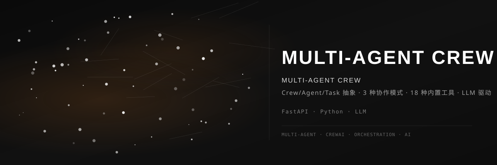

<div align="center">



<br>

### 👥 多智能体协作系统

[](https://github.com/dirjaker/multi_agent_crew/stargazers)
[](https://github.com/dirjaker/multi_agent_crew/network/members)
[](https://github.com/dirjaker/multi_agent_crew/graphs/contributors)
[](https://github.com/dirjaker/multi_agent_crew/blob/dev/LICENSE)

</div>

---

## ✨ 功能特性

| 功能 | 描述 |
|------|------|
| 👥 **Crew 抽象** | 团队、角色、任务三层抽象模型 |
| 🔄 **3 种协作** | 顺序执行、并行执行、层级管理三种模式 |
| 🧰 **18 种工具** | 搜索、代码、文件、网络等内置工具集 |
| 🤖 **LLM 驱动** | 基于大语言模型的智能决策和执行 |
| 📋 **任务编排** | DAG 图结构的任务依赖和调度 |
| 📊 **执行追踪** | 完整的协作过程记录和回放 |


## 🚀 快速开始

```bash
# 克隆项目
git clone https://github.com/dirjaker/multi_agent_crew.git
cd multi_agent_crew

# 创建虚拟环境
conda create -n multi_agent_crew python=3.12 -y
conda activate multi_agent_crew

# 安装依赖
pip install -r requirements.txt

# 运行项目
python main.py
```

## 🛠️ 技术栈

| 层级 | 技术 |
|------|------|
| **后端** | FastAPI, Pydantic |
| **AI 引擎** | OpenAI, DeepSeek |
| **工具集** | Python, subprocess |
| **存储** | SQLite |

## 📝 开发日志

- [x] Crew/Agent/Task 模型
- [x] 3 种协作模式
- [x] 18 种内置工具
- [x] LLM 驱动决策
- [x] 执行追踪
- [ ] Web 可视化编辑器
- [ ] 更多协作模式
- [ ] 分布式执行

## 📄 许可证

[MIT License](LICENSE)

---

<div align="center">

🔗 **GitHub**: [dirjaker/multi_agent_crew](https://github.com/dirjaker/multi_agent_crew)

⭐ 如果这个项目对你有帮助，请给一个 Star 支持一下！

</div>
